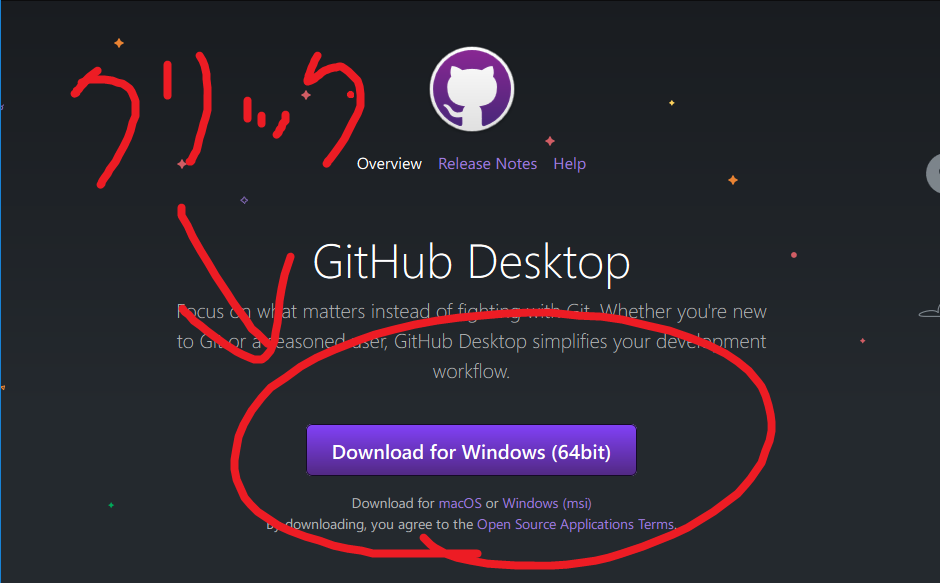
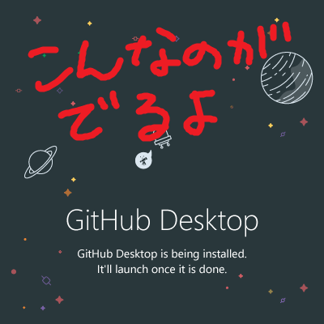
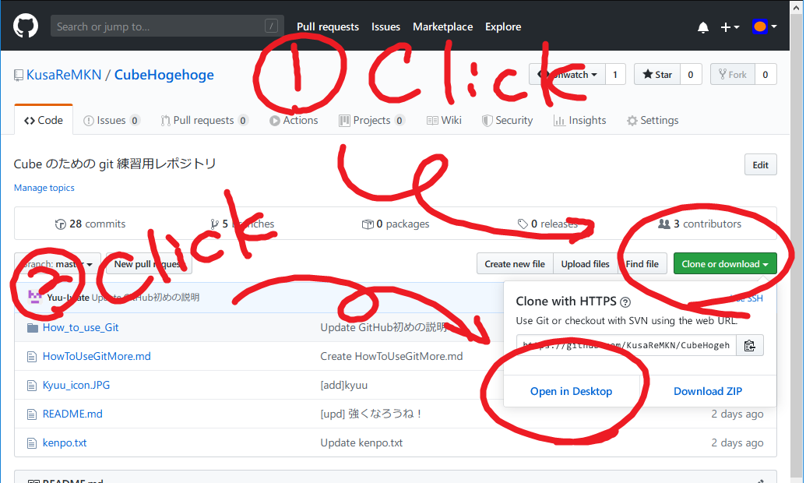
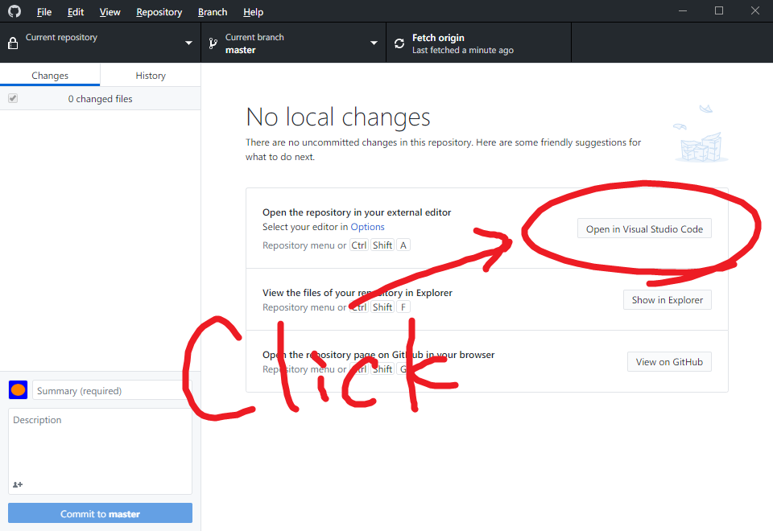
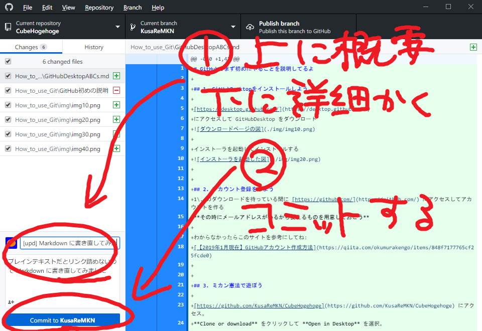
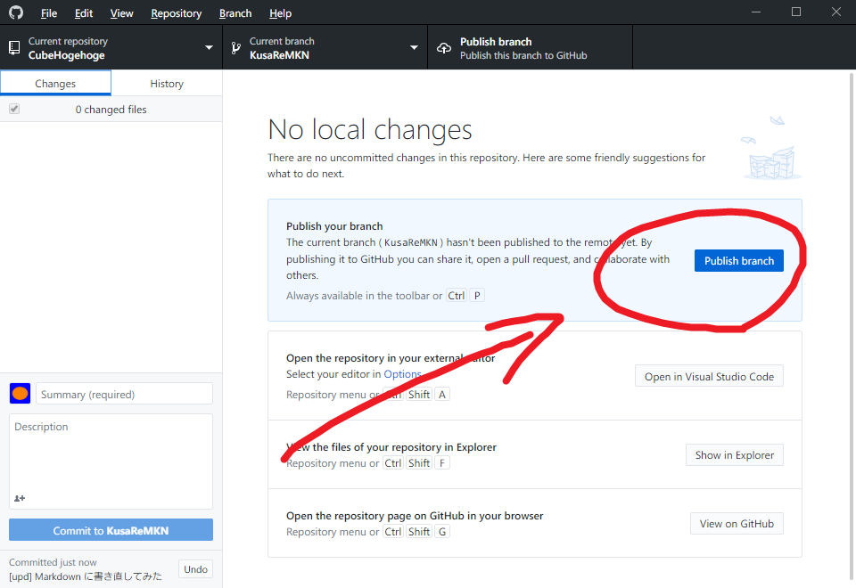

# GitHubでまず初めにやることを説明してるよ

## 1. GitHubDesktopをインストールしよう

[https://desktop.github.com/](https://desktop.github.com/)
にアクセスして GitHubDesktop をダウンロード

インストーラを起動してインストールする

## 2. アカウント登録をしよう
1\. のダウンロードを待っている間に [https://github.com/](https://github.com/) にアクセスしてアカウントを作る
**その時にメールアドレスがいるから使えるものを用意しておこう**

わからなかったらこのサイトを参考にしてね:
[【2019年1月現在】GitHubアカウント作成方法](https://qiita.com/okumurakengo/items/848f7177765cf25fcde0)

## 3. ミカン憲法で遊ぼう

[https://github.com/KusaReMKN/CubeHogehoge](https://github.com/KusaReMKN/CubeHogehoge) にアクセス。
**Clone or download** をクリックして **Open in Desktop** を選択。

Open the repository in your external editor の **Open in Atom** もしくは **Open in Visual Stdui Code** を選択

※テキストエディターが入っていないときは
[https://atom.io/](https://atom.io/) か [https://code.visualstudio.com/](https://code.visualstudio.com/) にアクセスしてインストールしよう！
ATOM版の参考サイトは[これ](https://pg-happy.jp/atom-texteditor.html)
VS版の参考サイトは[これ](https://eng-entrance.com/texteditor-vscode)

kenpo.txtに「名前＋読んだよ」って書いて好きに編集しちゃおう！

## 4. 自分が編集したファイルをGitHubで共有しよう
3\. で好きに編集した後ファイルを保存して、コミットメッセージを書いたら GitHubDesktop の青い **Commit to master** をクリック。

Push to originを押して完了

## 5. おわり
おめでと！これで君もCube国の一員じゃ
