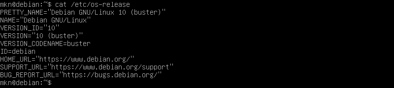
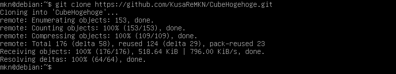
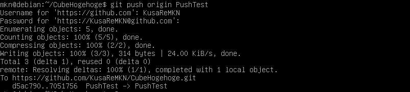

# コマンドラインからの Cube Hogehoge

## -1. お願い

**私も勉強中です。**
おそらく、この文書には隠し味のように至る所に *間違いや怪しさ* がちりばめられています。

この文書に間違いに気づいたら、なんか適当に修正して Pull Request 投げてください。
気づき次第、即座に修正します。
多分。

## 0. 前提

### 0.0. 心構え
コマンドラインを使います。
キーボードを用意してマウスを投げ捨ててください。


環境によっては日本語が使えません。
英語力を鍛えてください。

### 0.1. アカウント
GitHub の垢を取っておいてください。
使います。

### 0.2. インターネット
インターネット回線を利用します。
モバイル回線を利用したパーソナルホットスポットでも作業は可能ですが、予期しない大容量通信が発生する恐れがあるので固定回線下での作業をお勧めします。

### 0.3. 環境
MS-Win の場合は [**Git for Windows**](https://gitforwindows.org/) をインストールしてください。
**Git Bash** を利用します。

MS-Win を使っていて、 Linux の雰囲気を味わいたい場合は、Windows 10 に限って [こんなもの](https://www.microsoft.com/store/productId/9NBLGGH4MSV6) があります。
それ以外の場合は、[Oracle VM VirtualBox](https://www.oracle.com/technetwork/jp/server-storage/virtualbox/overview/index.html) あたりと [適当な Linux デストリビューション](https://www.debian.org/) を落としてきてください。
**[インストール方法](../howtoinstalldebian/index.md)を書きました**。
CygWin という選択肢もありますが、パッケージのインストールが面倒くさいのでお勧めできません。

Linux は Debian 系を前提とします。
多分 Ubuntu とか CentOS あたりはそのまま読めると思います。
`apt` が動かない人は `yum` とかに読み替えてください。
*私は詳しくないです。*

日本語が文字化けして読めないという人は [この記事](https://eng-entrance.com/linux-localization-lang) を参考にして英語表示にしてください。
日本語を表示させる方法もありますが、*表示できるのに入力できないという状態* はなかなかにもどかしいものがあります。
システムを汚す覚悟のある人は [この記事](https://qiita.com/Pseudonym/items/12e447557a5234bb265b) を参考にしてください。


とりあえず私の環境はこんな感じです(エミュで動かしてます):




## 1. git のインストール

**Git for Windows で Git Bush を利用している場合はこの章をスキップしてください。**

git をインストールします。
`apt` コマンドを利用しますが、この時に **`update` (必要に応じて `upgrade` も) を(ほぼ必ず)実行**してください。
これをすることで、 apt のパッケージリストの情報を最新の状態にすることができ、より新しいパッケージを取得することができます。
これは他のパッケージをインストールするときにも言えます。

```
$ sudo apt update
$ sudo apt upgrade
$ sudo apt install git
```

git のバージョンを表示させてインストールされていることを確認します。
`git version 2.20.1` のように出力されればインストールは完了です。

```
$ git --version
```


## 2. git のセットアップ

ユーザ名とメールアドレスを `git` に設定します。
GitHub に登録したユーザ名とメールアドレスを利用します。
**シングルクォートは省略しないほうが良いでしょう。**

```
$ git config --global user.user 'ユーザ名'
$ git config --global user.email 'メール@アドレス'
```

必要であればエディタを設定できます。
これはコミットメッセージの編集などに利用されます。
私は適当に Vim を設定してみます。

```
$ git config --global core.editor 'vim'
```

より詳しい設定項目を知りたいなら [Git のカスタマイズ - Git の設定](https://git-scm.com/book/ja/v2/Git-%E3%81%AE%E3%82%AB%E3%82%B9%E3%82%BF%E3%83%9E%E3%82%A4%E3%82%BA-Git-%E3%81%AE%E8%A8%AD%E5%AE%9A) が役に立つでしょう。


## 3. 試しにクローンしてみる

ここまで出来たら試しに Cube Hogehoge のレポジトリをクローンしてみましょう。
画像のように `Cloning into 'CubeHogehoge'...` と出力され、すべて `Done.` となれば正常です。

```
$ git clone https://github.com/KusaReMKN/CubeHogehoge.git
```



この時、クローンしたレポジトリは `./CubeHogehoge/` に展開されています。
カレントディレクトリを移動しておきましょう。
\[Tab\] を押してファイル名補完機能を利用すると楽になります。

```
cd CubeHogehoge/
```


## 4. ブランチ関連

ところで、いまクローンしたブランチはデフォルトブランチです。
デフォルトブランチは `master` です。
確認してみましょう。
`* master` のように出力されるはずです。
アスタリスクのついているブランチが現在の作業ブランチです。

```
$ git branch
```

新しくあなたのブランチを作ってみましょう。
現在のブランチから派生ブランチを作成するには、以下を実行します。

```
$ git branch ブランチの名前
```

ここで注意しなければならないのは、現時点ではブランチが作成されただけであって **現在のブランチは変更されていない** ということです。
`git branch` を実行して確認してみると良いでしょう。
作業ブランチを変更するには以下を実行します。
`Switched to branch 'ブランチの名前'` と出力され、ブランチが切り替わります。

```
$ git checkout ブランチの名前
```

これらを同時に行うには次を実行します。
~~これを先に書け~~

```
$ git checkout -b ブランチの名前
```

**基本的に、ブランチ master に直接操作を書き込むのはご法度です。**
master は完成品を配置するべきところです。
好き勝手に master を弄ってバグが出ると製品に影響を及ぼすことになります。
そのため、作業は各ブランチで行い、必要な時に統合します。

ブランチを削除するには、削除したいブランチから離れて以下を実行します

```
$ git branch -d ブランチ
```


## 5. ファイルの編集

とりあえず適当にファイルに書き込んでみることにします。
おそらく `./test.txt` があるので適当なエディタで開くかなんかしてください。
*Vim の上書き終了は <kbd><kbd>Esc</kbd></kbd> 押して `:wq` <kbd><kbd>Enter</kbd></kbd> だぞ！*

```
$ vim test.txt
```


## 6. ステージしてコミット

上で行った編集をステージします。
今回編集したファイルは `test.txt` ですから以下のように実行します。

```
$ git stage test.txt
```

それをコミットします。
以下を実行するとエディタが立ち上がってコミットメッセージの入力を促されます。

```
$ git commit
```

エディタが立ち上がるのが面倒な場合は、以下のコマンドでコミットメッセージを指定できます。

```
$ git commit -m 'コミットメッセージ'
```


## 7. リモートレポジトリにプッシュ

リモートレポジトリにコミットした内容をプッシュするには以下を実行します。
すると GitHub のユーザ名とパスワードを求められるので入力します。

```
$ git push origin ブランチの名前
```



これを実行するとリモートレポジトリにブランチの内容が反映されているはずです。
[GitHub 上の Cube Hogehoge](https://github.com/KusaReMKN/CubeHogehoge) にアクセスして確認してみましょう。


## 8. おわりに

**いかがでしたか？**
初めのうちはコマンドラインでの操作に慣れないかと思いますが、これを身につけることでより幅広い現場で活躍できるはずです。
CLI になれると GUI ではかなわないような作業速度を手に入れることができるようになるかもしれません。
また、 `git` コマンドには多くの、**本当に多くの** サブコマンドやオプションが存在します。
これらを使いこなしてよりよい git ライフを手に入れましょう！


## 9. 参考文献

- [Linuxのローカライゼーション系LANG変数：langについて](https://eng-entrance.com/linux-localization-lang)
- [VSCodeでのGitの基本操作まとめ](https://qiita.com/y-tsutsu/items/2ba96b16b220fb5913be)
- [Git のカスタマイズ - Git の設定](https://git-scm.com/book/ja/v2/Git-%E3%81%AE%E3%82%AB%E3%82%B9%E3%82%BF%E3%83%9E%E3%82%A4%E3%82%BA-Git-%E3%81%AE%E8%A8%AD%E5%AE%9A)
- [Gitブランチ関連コマンド](https://qiita.com/ayakix/items/55dc4a324a49ff200c2d)
- [ブランチ切って更新してマージするまでの流れ](https://qiita.com/shuntaro_tamura/items/6c8bf792087fe5dc5103)
