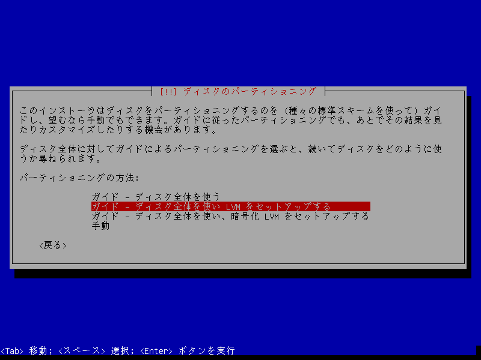
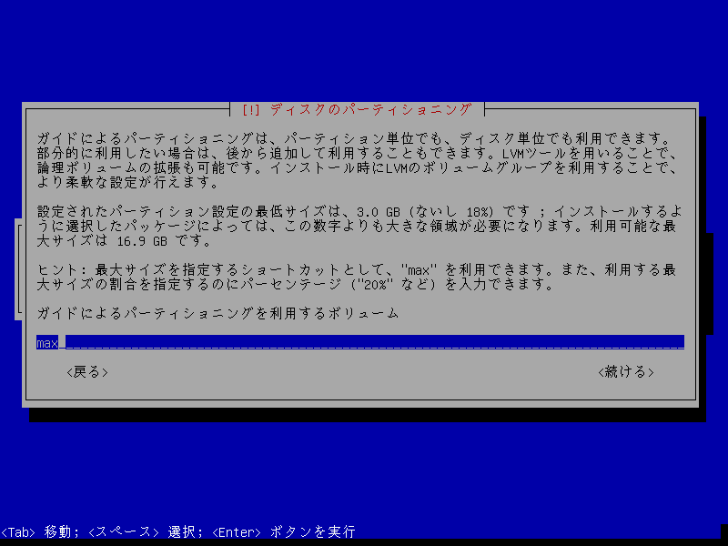
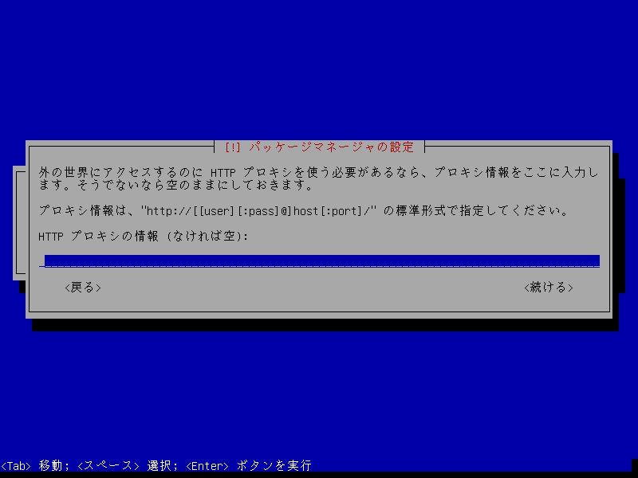
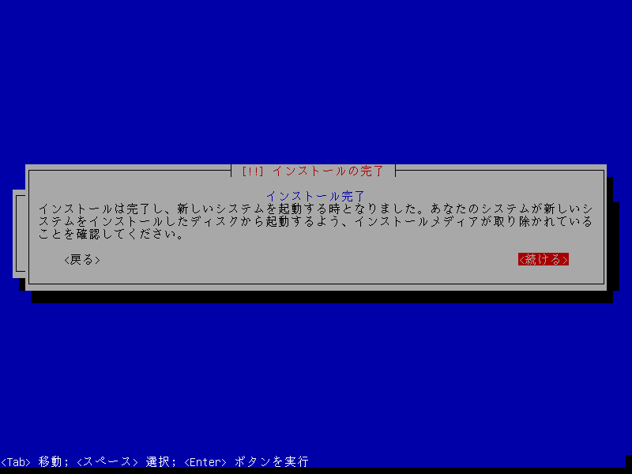

# Debian をインストールする

## -1. お願い

**私も勉強中です。**
おそらく、この文書には隠し味のように至る所に *間違いや怪しさ* がちりばめられています。

この文書に間違いに気づいたら、なんか適当に修正して Pull Request 投げてください。
気づき次第、即座に修正します。
多分。


## 0. 前提

Debian の CLI をインストールします。

[Oracle VM VirtualBox](https://www.oracle.com/technetwork/jp/server-storage/virtualbox/overview/index.html) の上で実行されることを想定します。
実機でもおそらく同様の手順でインストールを実行できますが、細部が異なる恐れがあります。
また、**データなどの損失の責任は負いかねます**。

利用している Debian は [こちら](https://www.debian.org/distrib/) からダウンロードできます。
**インストールイメージのダウンロード** をクリックし、適切なアーキテクチャを選択してください。
VirtualBox を利用する場合は **i386** を選択してください。

VirtualBox の操作方法の説明は行いません。
これについては別の記事を書くかもしれません。

## 1. インストールディスクを入れて起動

インストールディスクを入れて PC を起動すると画像のような画面になるので **Install** を選択します。


## 2. ロケールの選択

しばらくすると画面が切り変わって **Select a language** と名づけられたウィンドウが表示されます。
日本語を利用したい場合は、下のほうに**日本語**があるので選択します。
面倒だという人は **English** や **C (No localization)** を選択してもよいかもしれません。
英語系を選択するとインストールが若干速くなるかもしれません(*当社比*)。


次に場所を尋ねられます。
**日本 (Japan)** などの自分の住んでいる地域を選択します。


続けて、キーボードのキーマップを尋ねられます。
利用しているキーボード(通常は**日本語**)を選択してください。


## 3. しばらく待つ

待ちます。
まれに CD も HDD も止まって進捗表示も進まないときがあります。
長時間その状態が続く場合は初めからやり直してください。

## 4. ネットワークの設定

ネットワークの設定 と名付けられたウィンドウが表示されます。
ここでは、システムのホスト名を設定します。
環境下でサーバシステムやホームネットワークシステムを構築していない限り、この設定はそのままで(或いは何を設定しても)構わないでしょう。


続いて、ドメイン名を尋ねられます。
ここの設定の推奨値がよくわかりません(*誰か教えて!*)。
もしあなたが MS-Win の PC を持っているならワークグループ名(デフォルトは `WORKGROUP`) を設定するのが良いのかもしれません。
空も可能です。


## 5. ユーザの設定

まず、**root** のパスワードを尋ねられます。
root とは、MS-Win における Administrator ユーザのような特別なユーザで、システムのあらゆる部分を変更可能です。

私は、このユーザとしてログインすることは**控えられるべき**だと考えます。
つまり、root としてログインできないようにします。
この欄は空のまま続行します。
必要に応じて設定してください。


パスワードを確認されるので、再度入力します(空の場合は空のままにします)。


次に、ユーザアカウントについて尋ねられます。
ここではユーザのフルネームを入力します。


続いて、ユーザ名を尋ねられます。
任意のユーザ名を指定します。


続いて、ユーザのパスワードを設定します。
パスワードはすべて `*` で表示されることに注意してください。


確認で再度入力します。


## 6. またしばらく待つ

待ちます。
私の環境では **partitioner を開始しています** のウィンドウが表示されたまま止まることがよくあります (36% 地点)。
止まったら初めから。
この記事を書いているときは 2 回目で行けました。


## 7. ディスクのパーティショニング

ディスクのパーティショニングについて尋ねられます。
よくわかりませんが(*誰か詳細教えて!*)、とりあえず真ん中を選びます。



ディスクを選択します。
HDD や SSD を複数詰んでいる場合は、インストールするディスクを適切に選択してください。


パーティショニングの機構について尋ねられます。
パーティションの分割については [この記事](https://www.atmarkit.co.jp/ait/articles/0107/04/news001_2.html) が役に立ちそうです。
今回はより無難なものを選択しておきましょう。


ディスクにすでにパーティションが存在すると以下のような警告が表示されます。
内容を確認して続行してください。


パーティションをディスクに書き込む際の警告が表示されます。
内容をよく確認して続行します。


パーティションのサイズを尋ねられます。
そのままの設定で確定します。



ディスクに書き込みを行う警告が表示されます。
内容をよく確認して続行します。


## 8. 待ちます

多分ここでお湯を注げばカップ麺ができます。
すぐ食べればぼちぼち食べ終われるかもしれません。
とりあえずゆっくりお茶でも飲みましょう。

## 9. ごちそうさまでした

apt で利用される CD や DVD の走査を実行できます。
そのようなディスクを持っているのならここで実行してしまいましょう。
私は持っていないので **いいえ** を選択します。


## 10. パッケージマネージャの設定

アーカイブミラーのサーバを設定します。
日本にいて、大抵の場合は **日本** の選択で問題ありませんが、**大韓民国 (韓国)** を選択したほうが速度が出る場合がまれにあります。


アーカイブミラーを選択します。
日本の場合は、`ftp.jp.debian.org` を選択すればいい感じのようです。


プロクシの設定について尋ねられます。
必要な場合は設定してください。
通常は空のままでよいです。



途中でパッケージの利用状況を共有するか聞いてくるので参加する意思があれば参加してください。
私はしません。


## 11. ソフトウェアの選択

インストールするソフトウェアを尋ねられます。
デスクトップ環境は今回必要ないのでチェックを外します(矢印で選択して \[Space\] で選択を切り替えます)。
サーバ関連は必要なものを適宜選択してください。
また、**標準システムユーティリティは必ずチェックを入れて**ください。


## 12. 待ちます

疲れたね。

## 13. GRUB のインストール

他にインストールされている OS がなければこのまま続行します。


続いてインストールするディスクを尋ねられるので一番目のハードディスクを選択します。


## 14. また待ちます

もう特に書くことがないのでみんな Twitter でも見ててください。

## 15. あっ！

インストールが完了しました。
ディスクが出てくるので回収して続行します。




## 16. 再起動、そして Debian の世界

勝手に再起動するのでしばらく放置します。
~~放置少女です。つよそう。~~

ログイン画面が表示されます。
**質素な感じが上品でいいですね。**


ユーザ名を入力して \[Enter\] します。
続いてパスワードを求められるので入力します。
パスワード入力時は **`*` すら表示されません**。
ちゃんと入力できているのか不安になりますが恐れないでください。
**ちゃんと入力できてます。**


## 17. 日本語表示

ところで、今のままだと日本語が表示できません。
素敵な ♦ ですべて文字化けします。


これを解決するには `fbterm` を実行します。
コマンドは次の通り。

```
$ fbterm
```

すると文字の雰囲気が変わります。
これで日本語が表示できるようになります。


## 18. 続き

[日本語化します](./japanese.md)
