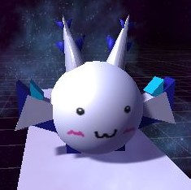

# Cube Hogehoge

## このレポジトリは何

なんか適当に Cube の運営に関する何某をおいてみたり git の練習をしたりするレポジトリだよ
**このレポジトリを弄り倒して git に強くなろね！！**

## 制作物置き場ではありません！

このレポジトリにブランチを切って制作物置き場にしないでください！
制作物の進捗を記録するときは、**各自のアカウント**で新規レポジトリを作成してください。

## ブランチの切り忘れに注意してね

レポジトリに含まれるファイルを編集する場合はブランチを切ってください。
ブランチを切らずに編集作業を続行すると、同時に編集を行っているユーザと編集箇所が衝突(conflict)してしまい、作業進捗をプッシュできなくなります。

## これは kyuu ちゃん

